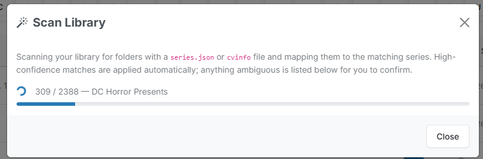
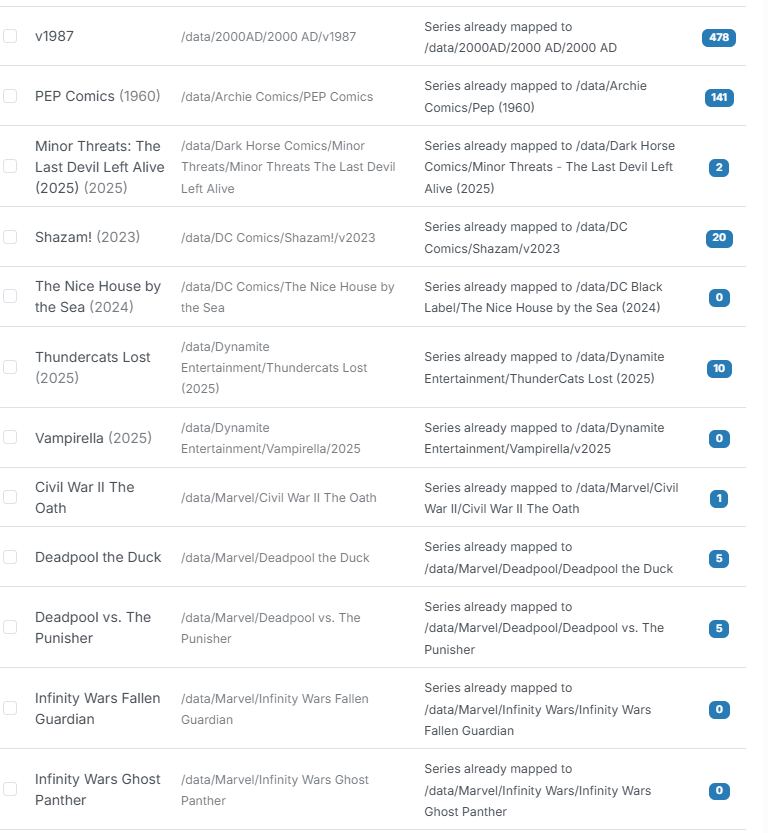
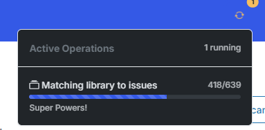

# Automap (Scan Library)

!!! info "New in v6.0"
    Library Import / Automap is new in **v6.0**. It's the fastest way to populate your [Pull List](pull-list.md) if you're migrating from another app.

If you already have a large library, populating the Pull List one series at a time is a chore. **Scan Library** reads the sidecar files already in your library, resolves each to a Metron (or ComicVine) series, and builds your Pull List for you in a single pass.

## What Automap does

1. Scans your library roots for **`series.json`** and **`cvinfo`** sidecar files.
2. Resolves each sidecar to a **Metron** or **ComicVine** series.
3. Classifies every result into **auto-mapped**, **needs review**, or **skipped** — with a reason shown for anything it couldn't place.

{: .center-image}

## Classification

| Classification | Meaning | Your action |
| --- | --- | --- |
| **Auto** | CLU resolved the sidecar to a single, confident series match. | None — it's mapped automatically. |
| **Needs review** | CLU found a likely match but wants you to confirm (e.g. multiple candidates or a fuzzy title). | Confirm or correct it in the review modal. |
| **Skipped** | CLU couldn't place it. | Read the reason; map the series manually later if needed. |

## The review workflow

Items marked **needs review** are confirmed in a modal. For each one, pick the correct series (or accept CLU's suggestion) and apply.

{: .center-image}

When you apply the mappings, CLU:

- **Backfills the sidecars** so each mapped folder carries the resolved series info going forward.
- Kicks off a **background sync** to pull issue lists and details from the provider.
- Runs a **collection match** to determine which issues you already own.

{: .center-image}

## Notes & behavior

- **ComicVine-only series** are supported — a series that only resolves on ComicVine will still map.
- Existing sidecar **`publisher`** and **`status`** values are **preserved** rather than overwritten.
- The **Mylar `<publisher>/<series>/v<year>/`** layout is handled correctly — the `v<year>` volume folder is no longer mistaken for the series name.
- On import, the **Monitor** flag is set intelligently: fully-owned series with an ended status (Cancelled/Completed) default to *Not Monitored*. See [Import Defaults](pull-list.md#import-defaults).

{: .center-image}

## Related

- [Pull List](pull-list.md) — where imported series land.
- [Series page](series.md) — mapping and subscription management for a single series.
