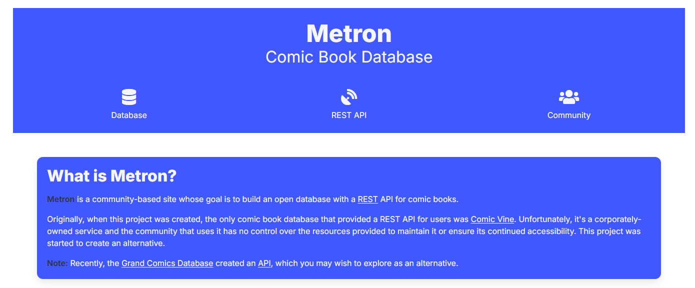

# Pull List and Series Management

{: .center-image}

CLU has a built-in pull list that allows you to keep track of the comics you want to collect.

- View Weekly Releases and Add them to Your Pull List 
- [Map your existing collection](automap.md) to the pull list in one scan to see what you're missing
- Search for a series and add it to your pull list
- View wanted and upcoming issues

!!! info "New in v6.5 — Wanted has two sources"
    The [Wanted](wanted.md) page still reports the missing issues for the series on your Pull List, and as of **v6.5** it can also report the issues you're missing from a [reading list](../collection/reading-lists.md).

    Reading-list tracking is **opt-in per list** — turn on **[Track Wanted](../collection/reading-lists.md#track-wanted)** on the list itself, and its unmatched entries appear under [From Reading Lists](wanted.md#from-reading-lists).

## Metron API Required

{: .center-image}

The pull list requires the Metron API to be enabled in the app settings.

Signup for your free account at [Metron](https://metron.cloud/) and enter the credentials in the [app settings --> Download & API](../app-settings/download-settings.md).

Continue reading to learn how to use the Pull List.