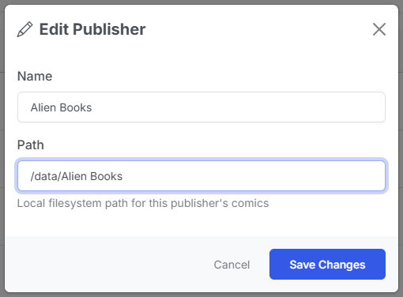

# Publishers

{: .center-image}

When you add a new series, CLU will create a new publisher if it doesn't exist. 

Currently, this is mostly a backend feature but there are possible feature regarding icons, logos, etc that could be added in the future.

## Publisher Table Fields

| Field | Description |
| --- | --- |
| ID | The unique identifier for the publisher from Metron. |
| Name | The name of the publisher. |
| Path | The path to the publisher's directory - must be mapped to a directory in UI. |
| Favorite | Indicates if the publisher is favorited. |
| Created At | The date and time the publisher was created. |
| Actions - Edit/Delete | Edit the publisher path/name or delete the publisher. |

## Publisher Table Actions

### Edit

Clicking the edit button will open a modal to edit the publisher. 

{: .center-image}
