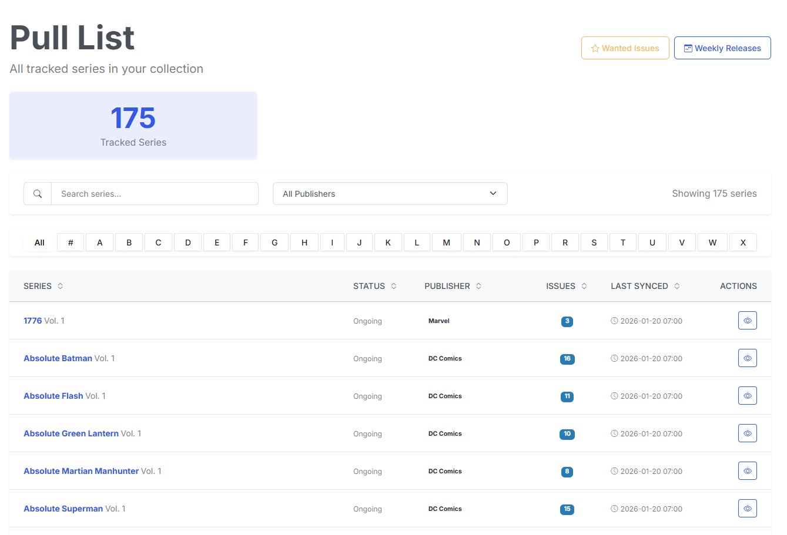

# Pull List

{: .center-image}

The pull list is a list of all the series you have subscriptions for. You can use this to see which series you are subscribed.

## Filter and Sort

The pull list can be filtered by publisher and series. It can also be sorted by series name, status, publisher, and series type and number of issues.

### Filter

There are multiple ways to filter your pull list to quickly find the series you are looking for.

| Filter | Description |
| --- | --- |
| Series | Type in the search box to filter by series name |
| Publisher | Select from the dropdown to filter by publisher |
| Alpha | Click the A-Z button to filter by series name alphabetically |

### Sort

There are multiple ways to sort your pull list to quickly find the series you are looking for as well. Simpley click the Table Header to sort that column. 

| Sort | Description |
| --- | --- |
| Series | Sort by series name |
| Publisher | Sort by publisher |
| Status | Sort by status |
| Issues | Sort by number of issues |
| Last Synced | Sort by last synced date |

### Series Name

Clicking on the series name will take you to the series page where you can view the series details and manage your subscription.

## Monitoring

{: .center-image}

Each series on your Pull List has a **Monitor** flag. When a series is set to **Not Monitored**:

- Its row is **greyed out** on the Pull List.
- It is **excluded from the wanted-issues refresh**.
- It is **excluded from DDL/Usenet auto-download**.

Turn monitoring off for series where you already have every issue, know the remaining issues aren't available, or simply don't want CLU searching for them on a nightly basis.

!!! info "New in v6.0"
    Monitoring, collection health color-coding, and bulk actions are new in **v6.0**. You can also toggle the Monitor flag per series from the [Series page](series.md#monitor).

## Collection Health Color-Coding

Rows are colored by collection status so you can see the health of your library at a glance. A **status filter** and an on-page **legend** let you filter for series that need attention (for example, only series that are missing issues).

| Status | Meaning |
| --- | --- |
| **Complete** | You own every released issue of the series. |
| **Missing** | One or more released issues are missing from your collection. |
| **Upcoming** | The series has issues with a future store date but nothing currently missing. |

!!! note
    The exact colors follow your theme's palette; use the on-page legend as the source of truth for what each color means.

## Bulk Actions

You can act on many series at once using checkbox multi-select:

| Action | How |
| --- | --- |
| Select a single series | Click its checkbox. |
| Select a **range** | Click one checkbox, then **SHIFT**-click another. |
| Toggle individual series | **CTRL** (Windows/Linux) or **CMD** (macOS) + click. |

With rows selected, use the toolbar to flip the whole batch to **Monitored** or **Not Monitored** in one action.

<!-- TODO: screenshot — bulk checkbox selection + toolbar (assets/pull/bulk-select.png) -->

## Import Defaults

When [Scan Library](automap.md) imports a series, its Monitor flag is set intelligently:

- A series that is both **fully owned** *and* has an **ended status** (Cancelled/Completed) defaults to **Monitor off** — a finished, fully-collected run won't waste nightly searches.
- The gate is **conservative**: monitoring is only ever turned **off** automatically, **never back on**, so import can't undo a choice you made.