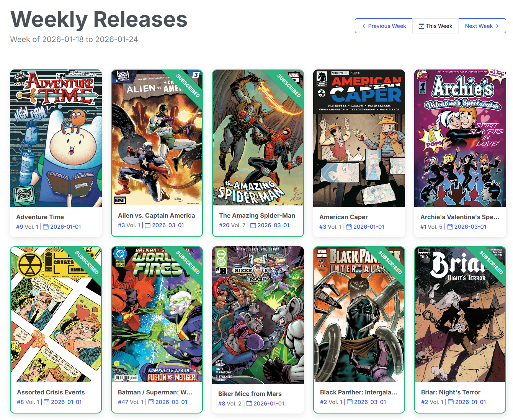

# Releases

{: .center-image}

## Weekly Releases

The Weekly Releases page will show you a list of all comics that are slated to release for the current week.

Clicking on a comic on the weekly release page will take you to the series page for that comic. From there you can perform multiple actions:

- Subscribe to the comic
- Map to an existing series or update the mapping location 
- Check the API for new issues
- Check your local folder for missing/newly added issues
- Remove the series from your pull list

Continue on to the series page to learn more about each of these actions.

## Previous and Future Weeks

The Metron API provides release information for previous and future weeks. You can use the buttons at the top of the page to navigate to previous or future weeks.

## Publisher Filter

!!! info "New in v6.3"
    **Publisher filter pills** with live counts, above the release grid.

{: .center-image}

/// caption
Filter pills with live counts. The selection is mirrored into the URL.
///

Click a publisher pill to narrow the week's releases to that publisher. Filtering is **client-side**, so it's instant — no reload, no extra API calls.

The selection is **mirrored into the URL** as `?publisher=`, which makes a filtered view **deep-linkable**. Bookmark `.../releases?publisher=Marvel` and you land straight on that week's Marvel books, and the browser back button steps through your filter selections.

### The list fills in as you watch

!!! info "The list fills in as you watch"
    On a **cold week**, the publisher pills populate **progressively over the first few visits** rather than appearing complete immediately. This is expected behavior, not a bug.

    **Why:** Metron's issue-list endpoint returns objects that carry the series but **no publisher**, so there is nothing on the release data itself to group by. Resolving publishers one series at a time would mean roughly **150 API calls a week** against Metron's daily rate limit — which would burn your quota on a filter.

    Instead, CLU resolves publishers into a **self-warming cache**. A background pass sweeps in bulk using Metron's own server-side publisher filter, so a single filtered call resolves every series a publisher shipped that week, then does a capped number of per-series lookups for the tail. Each publisher discovered in the tail becomes a bulk candidate on the next pass, so a cold cache converges within a few passes.

    While the cache is filling, the page polls and re-renders as publishers arrive. Revisit the week — or just wait a moment — and the pills complete.

Once a week's publishers are cached, the filter is immediate on every subsequent visit.
