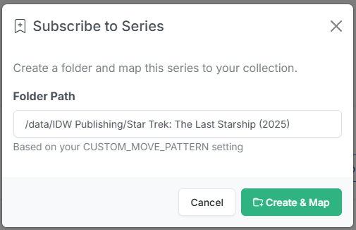
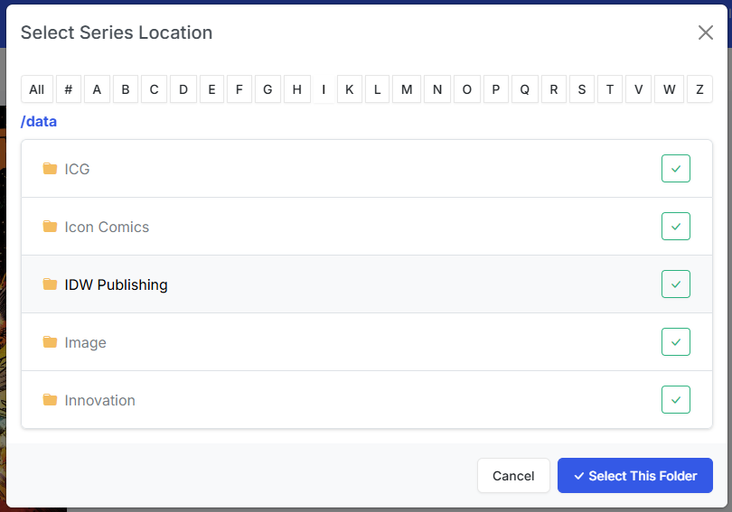

# Series

The Series page will load the details of the selected series from the Metron API. From this page you can perform multiple actions depending on your subscription status.

## Subscribe to Series

{: .center-image}

If you are not currently subscribed to the series, you will see two possible actions:

### Subscribe

Clicking the Subscribe will prompt you for the location to save the series.

{: .center-image}

The default path will be based on your CUSTOM MOVE PATTERN setting in the configuration. You can easily modify this if you want a different location for the series.

!!! note
    For example, I prefer  _/{Publisher}/{Series} ({Year})_  for my series naming but if there are multiple volumes, I'll use  _/{Publisher}/{Series}/v{Year}_

Once you have selected the location, click the **Create & Map** button to create the folder and save the subscription. CLU will automatically map issues to the series

### Map Location 

Clicking the Map Location button will open a modal, allowing you to map the series to an existing folder. This is useful if you already have issues of that series.

{: .center-image}

Simply navigate to the folder and click the <i class="bi bi-check-lg text-success"></i> or the "Select This Folder" button to map the series to the folder. CLU will then refresh and determine how many issues of the series you have.

Once you are subscribed to the series, you will see a different view:

## Existing Subscription

{: .center-image}

For existing subscriptions, you will see the following options:

### Remove

<i class="bi bi-x-circle text-danger"> Remove</i> will remove the subscription. No files will be deleted.

### Change Location

<i class="bi bi-folder-symlink text-info"> Change Location</i> will open the same modal as Map Location, allowing you to change the location of the series. Once you confirm the new location, CLU will refresh and determine how many issues of the series you have.

### API Sync

<i class="bi bi-arrow-repeat text-dark"> API Sync</i> will call the Metron API to get the latest issues and details for the series. This process is run nightly for all series. 

### Refresh

<i class="bi bi-arrow-clockwise text-success"> Refresh</i> will scan the mapped directory to check for existing/missing issues. .   

## Wanted / Skipped / Owned

By default, any issues not in the series folder will be marked as "Wanted" and will be searched for in the nightly pull process. 

{: .center-image}

You can mark issues as "Owned" if you have a copy in a trade or another location. This will prevent CLU from searching for the issue in the nightly pull process.

You can mark issues as "Skipped" if you don't want to search for the issue in the nightly pull process.

