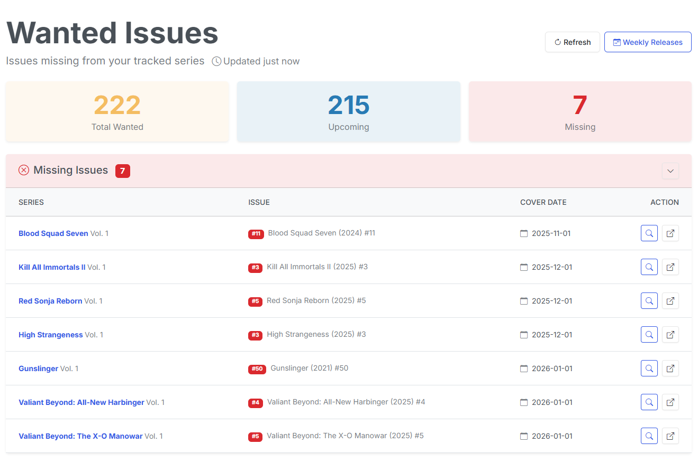

# Wanted

{: .center-image}

The wanted page will show you all missing and upcoming issues for the series you are subscribed to. We'll review the difference between missing and upcoming issues below.

## Missing Issues

Missing issues are issues that are missing from your collection that have a **Store Date** that is in the past.

The Missing Issues list is sorted by the **Store Date** in from oldest to newest.

### Search for Missing Issues

For missing issues in your collection, you can search for them on GetComics.org without leaving CLU. Simply click on the <i class="bi bi-search text-info"></i> **Search** button next to the issue.

This will open a modal and begin searching for the issue on GetComics.org. 

{: .center-image}

The modal will show you the results of the search and allow you to add the issue to your collection by clicking the <i class="bi bi-download text-info"></i> Download button next to the issue. This will [send the issue to your download queue](../file-downloads/send.md). 

{: .center-image}

You can adjust the terms in the modal to refine your search in an attempt to find the issue you are looking for.

## Upcoming Issues

{: .center-image}

This section will show you all upcoming issues for the series you are subscribed to. The issues are sorted by the **Store Date** in from oldest to newest.

This is simply a list of upcoming releases. Once the **Store Date** has passed, the issue will move to the **Missing Issues** section if it is not in your collection.