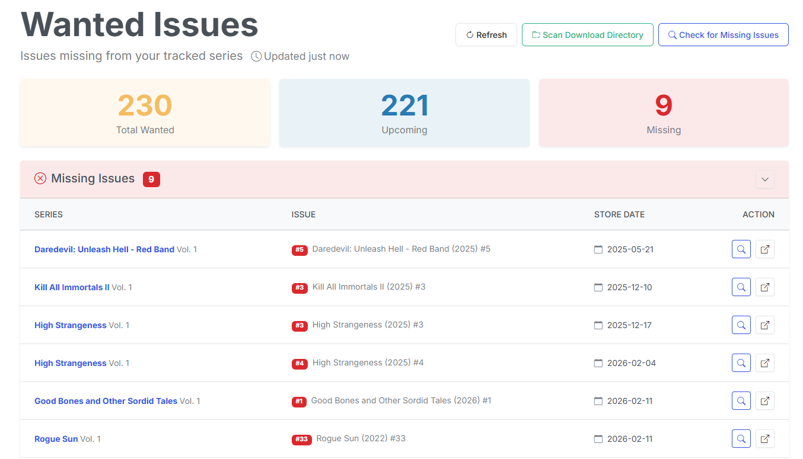
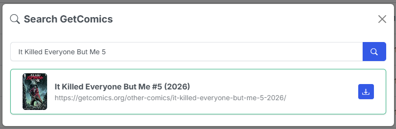
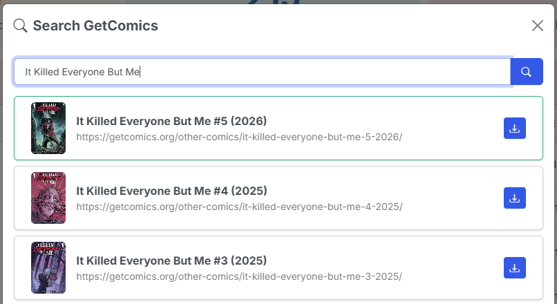
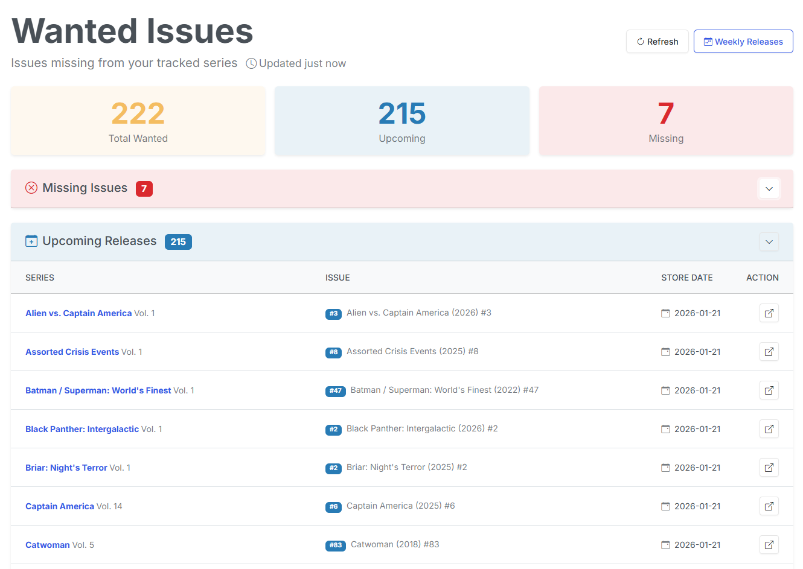

# Wanted

{: .center-image}

The wanted page will show you all missing and upcoming issues for the series you are subscribed to. We'll review the difference between missing and upcoming issues below.

At the very top, you'll see 3 buttons that perform actions related to the *Wanted* issues.

### Refresh

Checks all series in your Pull List and refreshes your _Wanted_ and _Missing_ issues.

### Scan Download Directory

This will scan your download directory to check for any files that may have been placed there since the last scan. This same process is triggered when a file or file(s) are moved to your TARGET directory.

### Check for Missing Issues

This will manually run the job to check for any issues in your _Wanted_ list. If [Usenet Downloads](../usenet/index.md) are configured, this checks **GetComics** and your Usenet indexers in [Source Priority](../usenet/source-priority.md) order; otherwise it checks GetComics only.

!!! info "New in v6.5 — you can see it running"
    The scheduled sweep and **Run Now** now report into the header's **Active Operations** indicator, not just the per-series button. A run that can last hours used to be completely invisible unless you'd started it from a series page.

    A sweep also **can't run twice over the same scope** — if a scheduled run is already in progress, a second trigger stands down rather than re-queueing everything the first run is still working through. See [Split posts and listing pages](../file-downloads/send.md#downloading-the-right-comic).

## Missing Issues

Missing issues are issues that are missing from your collection that have a **Store Date** that is in the past.

The Missing Issues list is sorted by the **Store Date** in from oldest to newest.

### Search for Missing Issues

For missing issues in your collection, you can search for them without leaving CLU. Simply click on the <i class="bi bi-search text-info"></i> **Search** button next to the issue.

This will open a modal and begin searching for the issue. 

{: .center-image}

The modal will show you the results of the search and allow you to add the issue to your collection by clicking the <i class="bi bi-download text-info"></i> Download button next to the issue. This will [send the issue to your download queue](../file-downloads/send.md). 

{: .center-image}

You can adjust the terms in the modal to refine your search in an attempt to find the issue you are looking for.

!!! info "GetComics + Usenet results"
    If you've configured [Usenet Downloads](../usenet/index.md), this search queries **GetComics** *and* your Usenet indexers together. Both sources appear under labeled section headers, ordered by your [Source Priority](../usenet/source-priority.md). Grab from either — see [Searching & Grabbing](../usenet/search-and-grab.md) for details.

## From Reading Lists

!!! info "New in v6.5"
    The Wanted page now has **two sources**. Alongside the series on your Pull List, it can also report the issues you're missing from a [reading list](../collection/reading-lists.md).

This section only appears once you've turned on **[Track Wanted](../collection/reading-lists.md#track-wanted)** for at least one reading list. It has its own **count tile** at the top of the page and its own table below.

Every entry in a tracked list that has **no matched file** shows up here, and the nightly GetComics sweep searches for it exactly as it does for a missing Pull List issue.

| Column | Meaning |
| --- | --- |
| **Series** | The series name as the reading list records it. |
| **Issue** | The issue number the list is asking for. |
| **Year** | The issue's year, where the list carries one. Often blank on back-catalogue lists — see below. |
| **Reading List** | Which list the entry came from. Links back to the list. |
| **Actions** | Search for the issue, the same [source search](../file-downloads/send.md#the-search-modal) as a missing issue. |

!!! info "Undated issues are searched, mapped-series issues aren't"
    This is the **opposite** of the rule that governs the rest of this page, so it will look like a bug if you don't know why.

    A release-calendar entry with **no date** is an unscheduled solicitation — it may never ship, so CLU leaves it alone. A **reading list is back catalogue**: a missing year there means the comic came out years ago and nobody recorded the date, not that it's unannounced. So a reading-list entry with no year is treated as **already released** and gets searched.

!!! info "A queued issue keeps showing here"
    An issue stays on this list until the **file actually lands and matches** — queuing a download doesn't remove it, because it's still missing.

    What *does* change is that CLU won't re-queue the same issue for **7 days**. A dead mirror, or an archive that won't unpack, can no longer produce the same download every single night.

Entries with a **blank series name or issue number** are excluded — they can never match anything, so there's nothing to search for.

Mapping an entry to a local file by hand removes it from this section immediately; clearing that mapping brings it back. See [Nothing is stored, so nothing goes stale](../collection/reading-lists.md#nothing-is-stored-so-nothing-goes-stale).

## Upcoming Issues

{: .center-image}

This section will show you all upcoming issues for the series you are subscribed to. The issues are sorted by the **Store Date** in from oldest to newest.

This is simply a list of upcoming releases. Once the **Store Date** has passed, the issue will move to the **Missing Issues** section if it is not in your collection.