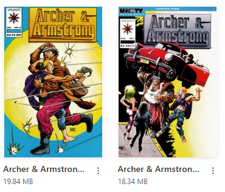

# Edit CBZ File

When viewing a single file in the [File Manager](../file-management/index.md) or [Collection](../collection/index.md), you can click the <i class="bi bi-three-dots-vertical fs-2 text-info"></i> button to open a CBZ file in the browser and rename/rearrange files, crop images, and delete images.

Once you select a CBZ file and click "Edit CBZ"  you will see a loading icon while the CBZ is extracted to a temp directory. Once this is complete, all of the image files will be displayed in the UI.

In the example above we can see the files in the CBZ. From this UI you can:

### Rename / Reorder Files

Clicking a file name will allow you to edit the file name. Press `ENTER` to save the changes. Once a file name has been edited, it will re-order in the UI based on alpha/number ordering.

In the image below, you can see that updating the filename to `00b.jpg` has re-ordered the file to appear in the CBZ after `00a.jpg`

### Upload Files

When editing the CBZ, you can drag and drop images to upload new files to the CBZ. I added this feature as many old comics are missing covers and I found it useful to be able to add them in the UI. Additionally, if you have a CBZ with a corrupted cover, it's easy to find the cover image and replace it in the UI. We'll use that as an example in the image below.

After selecting "Edit" for this CBZ and the Edit UP opens, I have located the cover image and dragged it into the UI.

Once the is uploaded, it will be added to the CBZ according to its alpha/numeric order and displayed in the UI. When images are uploaded, they are resized to the same dimensions as the rest of the images in the CBZ.

!!! info
    Only image files are allowed to be uploaded to a CBZ file. If you try to upload a non-image file, you will see   "No valid image files. Allowed: .jpg, .jpeg, .png, .gif, .webp, .bmp"

 I'll delete the corrupted cover and save the changes.The UI will update to show the new cover image.

### Crop Images

This is a more precise implementation of the [Crop Cover](crop.md) feature that allows you to select which piece of the cover you wish to save as the main cover image. For wrap-around or multi-page covers: 

Clicking the `<-| Left` button would crop and save the back as the new cover. The original image is never deleted. It is renamed and saved in the CBZ.

Clicking the `Right |->` button will crop the image to the right half and save that as the cover image.

Clicking the `Middle` button is used for Tri-fold covers where the main image is in the middle.

<i class="bi bi-crop text-primary"> Free</i> Crop lets you click and drag to free-form crop an image in the UI. 

* Click to draw your area
* SPACE to move the area
* SHIFT to maintain typical comic page proportions.

<figure></figure>

!!! info
    All Crop actions backup/preserve the original file in the CBZ and it should be instantly viewable. If you mistakenly crop something - just delete the file and start over.

### Delete Files

Clicking the <i class="bi bi-trash text-danger"></i> will delete the file from the CBZ. This is useful for removing extra images not related to the comic.

<figure></figure>

!!! danger
    **Warning:** The file/image is deleted immediately and this is not reversible.

### Save Changes

Once you have completed all actions on the file, click `Save` to re-pack the file and remove all temp files.

There is no cancel button - as cancelling would still need to re-pack the files.

### Skipped & Deleted File Types

In [File Settings](../app-settings/file-settings.md), you can configure certain file types to be automatically deleted whenever a CBZ is unpacked. For example, I have my setup configured to auto-delete the following types of files when they are found `.nfo,.sfv,.db,.DS_Store`

Additionally, you can configure file types to be skipped as well. This ensures that files like `.xml` are re-packed when the editing is completed.