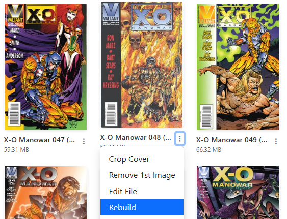

# Single File Rebuild

{: .center-image }

Accessible in the [File Manager view](../file-management/index.md) or [Collection view](../collection/index.md), via the <i class="bi fs-2 bi-three-dots-vertical text-dark"></i> dropdown menu. 

Running this will rebuild a CBZ file in an attempt to fix issues/errors with it not displaying correctly. Additionally, this will also convert a single CBR/RAR file to a CBZ

|                                      Before                                      |                                       After                                      |
| :------------------------------------------------------------------------------: | :------------------------------------------------------------------------------: |
|  |  |

## When a rebuild fails

!!! info "Fixed in v6.5 — a failed rebuild leaves your comic alone"
    A rebuild unpacks the archive and repacks it, so a failure used to leave the wreckage behind: the original renamed to `.bak` or `.zip`, sitting beside a folder of loose page images, with nothing readable where the comic used to be.

    As of **v6.5**, a failed rebuild **restores the comic exactly where it found it** and cleans up after itself. A rebuild that doesn't work now costs you nothing but the time.

Failures are also recorded on the **[Problem Files](../problem-files/index.md)** page, with the full archive error, so a rebuild that fails silently in a directory-wide run is no longer invisible.

!!! warning "Rebuild can't repair real damage"
    Repacking fixes the **container**, not the contents — its one genuine repair is an archive that's a RAR wearing a `.cbz` name. A true CRC error aborts the extraction and no amount of rebuilding will bring those pages back.

    For a genuinely damaged comic, use **[Find a replacement](../problem-files/replacing-a-file.md)** from its Problem Files row instead.
