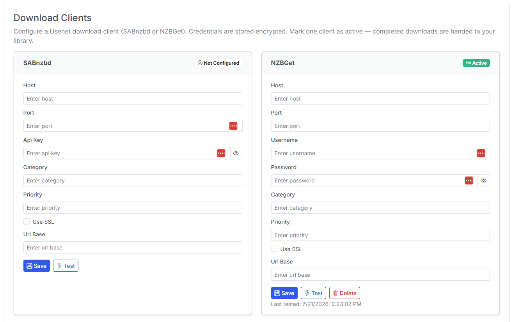

# Adding a Download Client

Your download client is the app — **SABnzbd** or **NZBGet** — that receives NZBs from CLU, downloads the articles from your Usenet provider, and assembles the finished files. CLU submits grabs to it and tracks them to completion.

{: .center-image}

You add and manage download clients from the **Download Clients** tab in Settings.

!!! warning "Only one active client"
    Only **one** download client is active at a time. If you configure both SABnzbd and NZBGet, only the one marked active will receive grabs.

!!! info "Editing saved clients"
    When you re-open a saved client, its fields are **pre-filled with the real stored values** and secrets have a working **reveal toggle**. Editing one field no longer wipes the others, so you can update a single value without re-entering everything.

## SABnzbd

| Field | Description |
| --- | --- |
| Host | The hostname or IP where SABnzbd is running (e.g. `192.168.1.10` or `sabnzbd`). |
| Port | The SABnzbd web port (default `8080`). |
| API Key | The **API Key** from SABnzbd → *Config → General → API Key*. |
| Category | The SABnzbd category to assign grabs to (e.g. `comics`). Optional but recommended so downloads land in a predictable folder. |

## NZBGet

| Field | Description |
| --- | --- |
| Host | The hostname or IP where NZBGet is running. |
| Port | The NZBGet web port (default `6789`). |
| Username | The NZBGet control username (default `nzbget`). |
| Password | The NZBGet control password. |
| Category | The NZBGet category to assign grabs to (e.g. `comics`). Optional. |

## Test Connection

After entering your details, click **Test Connection**. CLU makes a live call to the client and reports a readable result rather than a raw error. Common states:

| Result | Meaning | What to check |
| --- | --- | --- |
| **Connected** | CLU reached the client and authenticated. | Nothing — you're good. |
| **Connection refused** | Nothing is listening at that host/port. | Host, port, and that the client is running/reachable from CLU's container. |
| **401 / Unauthorized** | The client answered but rejected your credentials. | API key (SABnzbd) or username/password (NZBGet). |
| **Non-JSON response** | Something answered, but it wasn't the client's API. | You're likely pointed at the wrong port or a reverse proxy/login page. |
| **Timed out** | No response in time. | Network path, firewall, or the client being overloaded. |

!!! info "New in v6.0"
    Download clients are new in **v6.0**.
