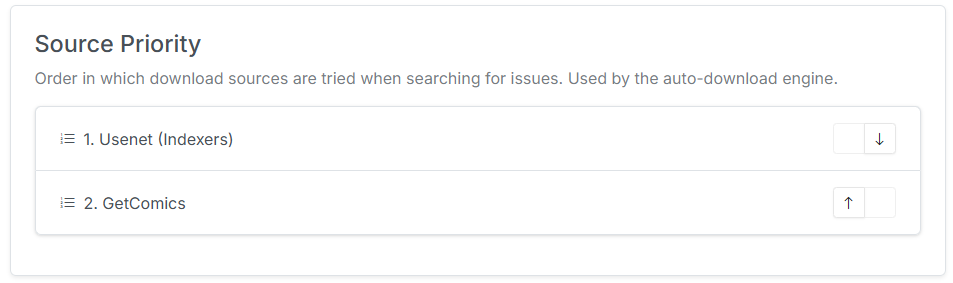
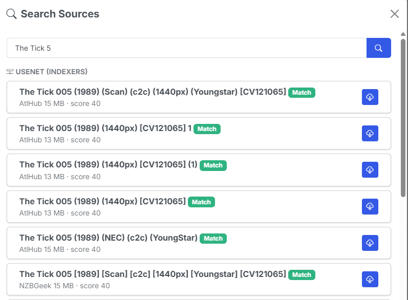

# Source Priority

**Source Priority** decides whether **Usenet** or **GetComics (Direct Download)** is tried first. It governs both automatic downloads and the order results are shown in the manual and Wanted search UIs. You set it from the **Download Clients** tab in Settings.

{: .center-image}

## Auto-download behavior

For nightly [auto-download](../pull-list/wanted.md), Source Priority determines which source can satisfy a wanted issue and in what order:

| Source Priority | Behavior |
| --- | --- |
| **Usenet first** | CLU searches Usenet first. A qualifying Usenet hit is grabbed and **GetComics is skipped** for that issue. |
| **GetComics first** | CLU tries GetComics first. Usenet acts as a **fallback** — it's only used when GetComics queues nothing for that issue. |

In both cases, only results that actually match the wanted issue are grabbed. A no-issue or bare-title release will never be auto-grabbed (see [Searching & Grabbing](search-and-grab.md)).

!!! note "Source vs Download Priority"
    **Source Priority** is different from **Download Provider Priority**. Download Provider Priority (which orders the DDL providers) is set globally in the **Download and API** tab. Source Priority decides which *type* of source (Usenet or GetComics) to try first for a wanted issue; Download Provider Priority only affects the ordering of DDL results relative to each other.

## Search UI behavior

In the manual per-issue search and on the [Wanted Issues](../pull-list/wanted.md) page, both sources are shown under labeled section headers. Source Priority controls **which section is listed first** so your preferred source is at the top; you can still grab from either.

{: .center-image}

## At a glance

| Scenario | Source Priority: Usenet first | Source Priority: GetComics first |
| --- | --- | --- |
| Usenet has a match | Grab from Usenet, skip GetComics | Grab from GetComics if it has one, else fall back to Usenet |
| Usenet has no match | Fall through to GetComics | Grab from GetComics |
| Neither has a match | Issue stays wanted | Issue stays wanted |

!!! info "New in v6.0"
    Source Priority is new in **v6.0** and only appears once you've added an indexer.
