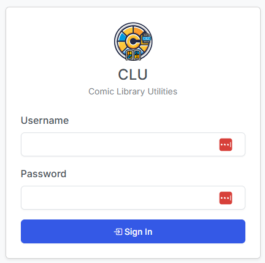

# First Run & Logging In

## Store Owner Setup

On a fresh install CLU shows a one-time **Store Owner Setup** screen at `/setup-owner`. Pick a username and a password; that account becomes the [Store Owner](roles.md) and, once it exists, the setup screen redirects home and never appears again.

You are **not** required to do anything else. With a single account and no environment gate, CLU stays in implicit-owner mode: no login screen, no role checks, no folder scoping.

## Logging in

Once a second account exists — or the `CLU_USERNAME`/`CLU_PASSWORD` environment gate is set — CLU requires a login.

{: .center-image}

Passwords are stored using werkzeug hashing, never in plaintext. The session secret is **persisted**, so logging in survives a container restart rather than logging everyone out on every upgrade.

## Migrating the legacy `CLU_USERNAME` / `CLU_PASSWORD` gate

Older CLU installs used two environment variables as a simple password gate. Those still work, but they are no longer the mechanism — they are a **seed**.

At startup, CLU migrates those credentials into a real, hashed Store Owner account. The same username and password keep working, but now through the normal login screen, and the account can be edited, given tokens, and joined by other accounts like any other.

!!! info "Setting the env gate forces multi-user mode"
    While `CLU_USERNAME`/`CLU_PASSWORD` are set, CLU runs in multi-user mode even with only one account. Remove them if you want the login-free experience back — see below.

See the [Config Installation](../app-settings/install.md) page for where these variables live in your Docker configuration.

## How to stay single-user

Implicit-owner mode is the default and requires nothing from you. To keep it:

- Keep exactly **one** account.
- Do **not** set `CLU_USERNAME` / `CLU_PASSWORD`.

## How to get back to no-login

If you tried multi-user and want the login-free experience back:

1. Delete every account except the Store Owner (see [Managing Users](managing-users.md)).
2. Remove `CLU_USERNAME` and `CLU_PASSWORD` from your Docker environment, if set.
3. Restart CLU.

!!! warning "Lost the only owner password?"
    The [last active Store Owner is protected](managing-users.md#last-store-owner-protection) and cannot be demoted, deactivated, or deleted, so you cannot lock yourself out from inside the app. There is, however, **no in-app password recovery** — setting `CLU_USERNAME`/`CLU_PASSWORD` after an owner already exists does *not* reset it, because those variables only seed an owner when no account exists at all. Recovering a forgotten owner password means resetting it directly in the CLU database. Ask on [Discord](https://discord.gg/ndDhpvrgBa) before you start.

## Changing a password

Passwords are changed from **Settings → Users** by a Store Owner, including the owner's own — see [Managing Users](managing-users.md). The [My Account](my-account.md) page covers appearance, dashboard layout, and API tokens only.
