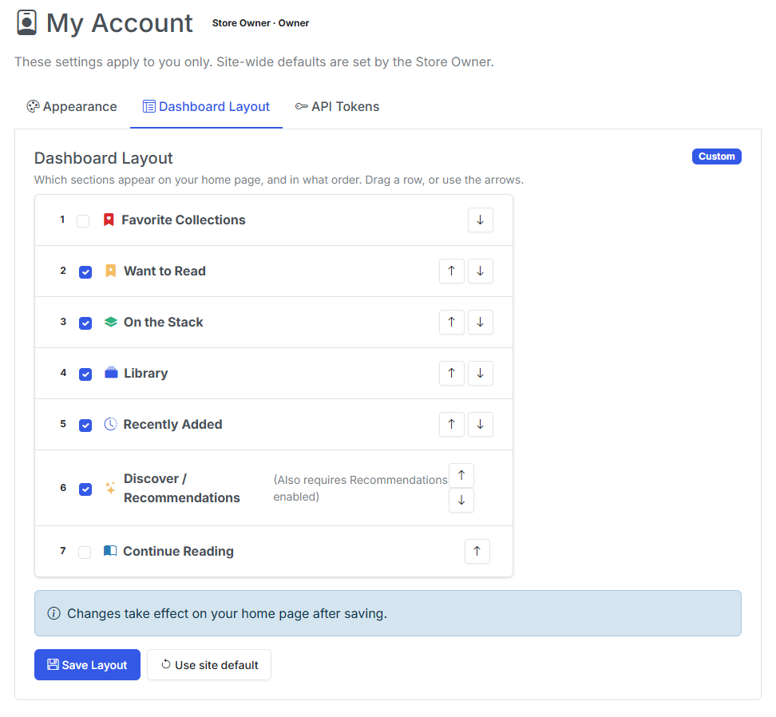

# My Account

!!! info "New in v6.3"
    **Appearance** and **Dashboard Layout** are new in **v6.3**. The **API Tokens** pane arrived in v6.2.

**My Account** (`/account`) is where *every* user — Reader included — manages the things that belong to them alone. It has three panes.

| Pane | What it controls | Who can change it |
| --- | --- | --- |
| **Appearance** | Your Bootswatch theme. | Every user, for themselves. |
| **Dashboard Layout** | The order of the homepage sections, and which are hidden. | Every user, for themselves. |
| **API Tokens** | Your own tokens for `/api/v1` and the mobile/desktop clients. | Every user, for themselves. A Store Owner can also mint and revoke tokens for any account from [Settings → Users](managing-users.md). |

## Getting there

Once there's a session, the top navigation gains a **person-icon dropdown** with **My Account**, **API Tokens**, and **Logout**.

!!! info "Single-user installs look exactly the same"
    The person-icon dropdown only appears when there's a session, so an install running in [implicit-owner mode](index.md#the-two-operating-modes) is visually unchanged. You still reach My Account from the **gear <i class="bi bi-gear-fill"></i> menu**.

## How your settings resolve

Each personal setting resolves in three steps, stopping at the first one that exists:

1. **Your personal override** — what you set here.
2. **The owner's site default** — what the Store Owner set in [Personalization](../app-settings/personalization.md).
3. **The hardcoded default** — CLU's built-in fallback.

A user with **no override follows the site default**. That is not a copy of it — it tracks it, so when the owner changes the site default your view changes with it.

Each pane shows a badge telling you which state you're in:

| Badge | Meaning |
| --- | --- |
| **Following site default** | You have no override. The owner's default applies now and will keep applying if they change it. |
| **Custom** | You have set a personal override. The owner's default no longer affects you. |

The **Reset** button on a pane deletes your override and returns you to *Following site default*.

## Appearance

{: .center-image}

/// caption
The Appearance pane, showing the theme picker with a Custom badge and a Reset button.
///

Pick any of CLU's Bootswatch themes. The change is yours alone — a Reader choosing a dark theme does not alter what the owner or anyone else sees.

!!! note
    The **Default** theme and the **Zephyr** theme are the only officially supported themes. The rest are provided as-is.

## Dashboard Layout

{: .center-image}

/// caption
The Dashboard Layout pane. Reorder sections and hide the ones you don't use.
///

Reorder the homepage sections and hide any you don't want. Hiding **Discover** now hides it for you, not for everybody.

For an explanation of each section, see the [Collection](../collection/index.md#sections) page.

## API Tokens

{: .center-image}

There are two ways an account gets a token:

- **Self-service** — you mint your own here. A token only ever authenticates as its owner, so it grants no privilege you don't already have.
- **Owner-minted** — a Store Owner mints one for any account from the user modal in [Settings → Users](managing-users.md).

!!! warning "Shown once"
    Tokens are stored **hashed**. The plaintext value is displayed exactly **once**, when it's created. Copy it immediately — if you lose it, you must revoke the token and mint a new one.

### What a token can reach

- **`/api/v1`** resolves the bearer token to its user, so reading progress, favorites, and library scope all land on the right account. Reader and Clerk tokens are **library-scoped** — a token cannot reach files outside its user's [grants](library-and-folder-access.md).
- **The legacy global token still works** and maps to the Store Owner, so existing clients keep running untouched.
- **`/api/insights`** accepts the same tokens as an optional `Authorization: Bearer <token>` header. With a token, the reading counters reflect that user; without one they reflect the Store Owner, so existing tokenless widgets are unchanged. An unknown or malformed token returns **401**.

### OPDS

OPDS readers authenticate with **HTTP Basic Auth** using the account's own username and password — not a token. `/opds/browse` and `/opds/to-read` filter to the authenticated user, and bad credentials return **401**. In [implicit-owner mode](index.md#the-two-operating-modes) OPDS stays auth-free exactly as before.

### Revoking a token

Revoking takes effect immediately. Any client still using that token starts getting **401** on its next call, so re-authenticate the client with a fresh token before you revoke the old one if you want no interruption.

## No migration on upgrade

!!! info "No migration"
    Upgrading changes nothing. Every account starts out with **no overrides**, which means every account follows the site default — exactly the behavior you had before per-user settings existed. Nobody's view changes until they choose to change it.
