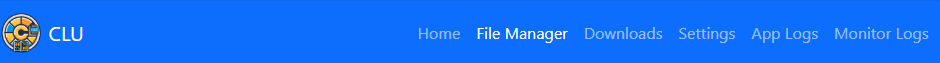

# Configuring the App

Once CLU is started, you can access the web interface at: `http://<your-server>:<port>`.

Using the default settings, this should be:

* `http://localhost:5577`
* `http://0.0.0.0:5577`
* `http://127.0.0.0:5577`

## Initial Run

!!! warning
    The first time you run the app (new install or upgrading to v4), it will scan and save you folder and file structure to the database. Additionally it will generate thumbnails for all files in your collection. This can take some time depending on the size of your collection. If you have a large collection, you may want to wait for this to complete before using the app.

### Features

The default page is the [Collection](../features/collection/index.md) page. This page will show you a list of all folders in your collection. [Directory Features](../features/directory-features/index.md) and [Single File Features](../features/single-file-features/index.md) are available to manage your collection.

The [File Management](../features/file-management/index.md) page is available to manage your files. It let's you manage your entire library remotely and Move, Rename and Delete directories and files all from one easy drag-and-drop interface.

### Navigation

Navigation in the header will let you access additional features like [Settings](../features/app-settings/index.md) and [File Downloads](../features/file-downloads/index.md).
